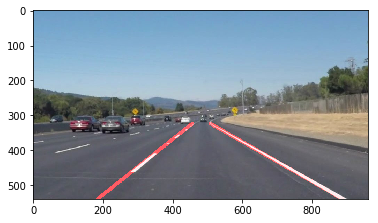

#**Finding Lane Lines on the Road** 
---

**Finding Lane Lines on the Road**

The goals / steps of this project are the following:

* Make a pipeline that finds lane lines on the road
* Reflect on your work in a written report

---

### Reflection

###1. Describe your pipeline. As part of the description, explain how you modified the draw_lines() function.

My pipeline applied my notes from the lectures almost in the exact same order they were presented. At first converted to grayscale, then applied gaussian_blur and canny edge.  An improvement here compared to my implementation for the lecture exercise is that I got the region of interest well defined. 

A lot of the values and numbers were found through experiments and iterations.

``` 
# always copy and work on copies
img_copy = np.copy(image)   

# basic transforms
image = grayscale(image)    
kernel_size=5
image = gaussian_blur(image, kernel_size)        
image = canny(image,100, 150)     

# select area of interest
imshape = image.shape
vertices = np.array([[(100,imshape[0]),(490, 310), (490, 310), (imshape[1],imshape[0])]], dtype=np.int32)
image = region_of_interest(image, vertices)
```

The `draw_lines()` function is calculating the slopes and grouping by left/right and then calculating a `running_average()` of both.  This is an area that I'm not 100% sure on how to use those values. 
  



It took me a lot of time to understand why and how I should use the average for the slope and the line. After some discussions on Slack I understood the reason for it (multiple lines with noise, not well "centered") and it helped me understand that.   Still I had to learn how to actually plot to lines to right extend which pretty much got done through:

```
topX = (img.shape[0] * line_length - lineAvg) / slopeAvg
bottomX = (img.shape[0] - lineAvg) / slopeAvg
```

The idea here being that the image size multiplied by the length I'd like the line to be less the the line average divided by the slope gives me the right value. To me it was quite challenging as well to keep in mind that openCV images has the origin at the top.

The challenge video is still not working and based on the discussions I've seen the tricky is to leverage HSV and saturate the image. As someone with very little familiarity with this I'd rather read the openCV documentation to understand more the concepts before trying to apply anything. 
 
###2. Identify potential shortcomings with your current pipeline

There are too many hardcoded values, numbers, which makes it a bit hard to generallize for any kind of image/video. This is easily doable and if I get to the challenge part I'll implement it. 
The current solution is not robust enough for driving at night.
~~My current pipeline is not properly printing the solid lines, I'm still revisiting a bit more of linear algebra (rusty knowledge here) to understand what's missing.~~
If another car gets infront of our car, the camera would not be able to capture the lanes for detection. It would have to infer that lanes are still there using other clues from the environment.

###3. Suggest possible improvements to your pipeline

A possible simple improvement could be read all the dimenions and calculate some of the static values.
Another potention improvement would be to implement a similar solution but for images at night. 


